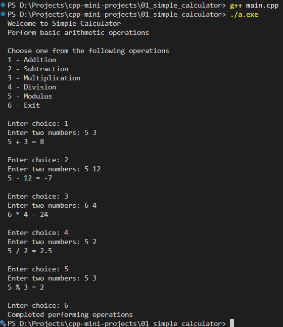

### Simple Calculator

#### Description

Simple menu-driven calculator performing basic mathematical operations

#### Features

- Menu-driven
- Basic Mathematical Operations - Addition, Subtraction, Multiplication, Division and Modulus

#### Screenshot



#### Concept Used

- Operators
- Functions
- Switch statement
- Loop statement

#### How to Run

1. Compile the code: ```g++ main.cpp```
2. Run the code: ```./a.exe```

---