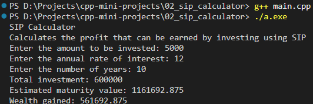

### SIP Calculator

#### Description

Helps user estimate the future value of the investment through a Systematic Investment Plan (SIP)

#### Formula

$$ 
    \text{Estimated Maturity Value = } P \times \frac {(1 + r) ^ n - 1} {r} \times (1 + r)
$$ 

#### Features

- Calculate SIP maturity amount
- Calculate total invested amount
- Calculate wealth gained

#### Screenshot



#### Concept Used

- Operators
- Functions
- Mathematical Calculations

#### How to Run

1. Compile the code: ```g++ main.cpp```
2. Run the code: ```./a.exe```

---